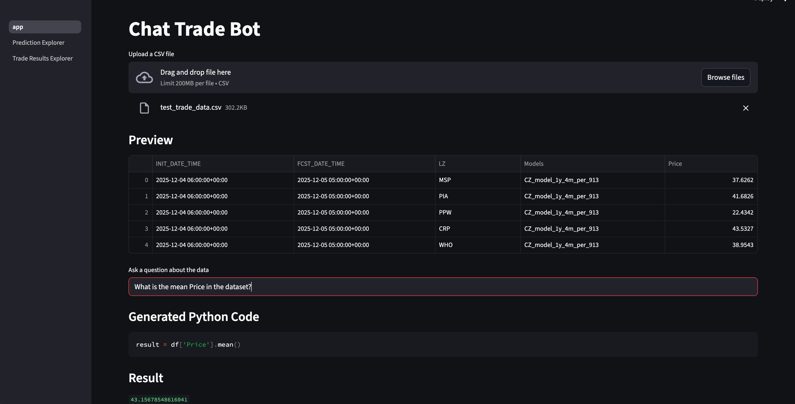
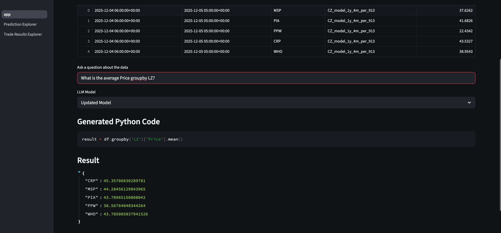
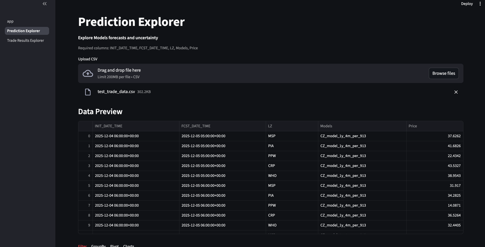
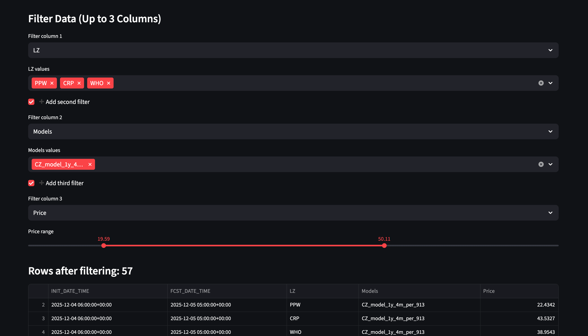
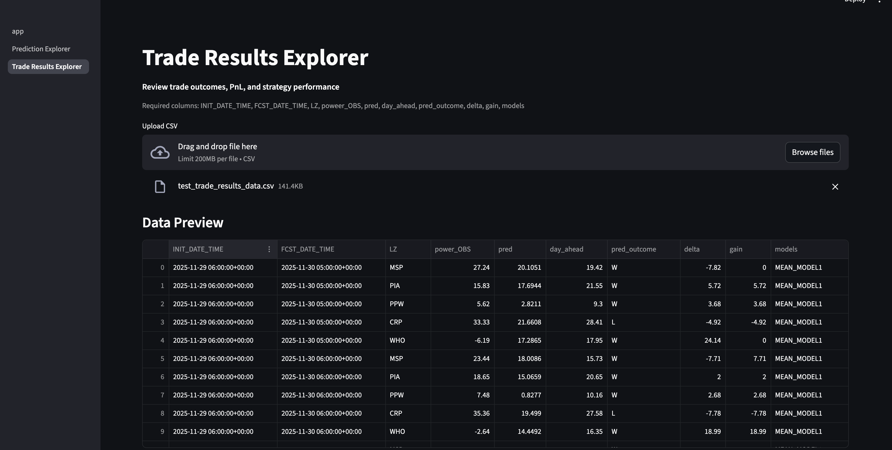
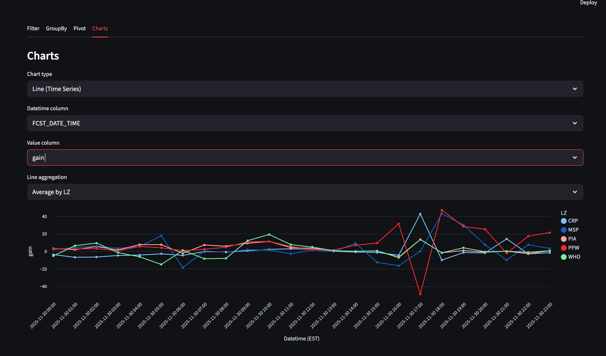

# LLM Model with FastAPI for Electricity Trade Analysis

## Overview
- This repository contains a prototype interactive electricity analytics application aimed at bridging the gap between electricity price predictions and electricity trading results, enabling users without coding experience to explore, analyze, and understand complex electricity market data through guided analytics and LLM-powered insights.

- The app allows users to import CSV datasets containing electricity forecasts, actual prices, and trading outcomes, and then analyze them in two complementary ways:
	- 1.LLM-Driven Analysis
	    - Users can ask natural-language questions about their data.
	    - The system supports two Hugging Face LLM options:
	        - Base model from Hugging Face (general-purpose, no extra training).
	        - Updated model from Hugging Face that has been fine-tuned using company-specific data via LoRA (more accurate on internal terminology + workflows).
	- The selected Hugging Face Large Language Model (LLM) generates Python/Pandas code on the fly to perform custom analysis, aggregations, and transformations.
	- This enables flexible, ad-hoc exploration without writing code manually.
    - 2.Pre-Built Analytics Sections
	    - Forecast / Training Analysis:
            - Pre-selected analyses focused on model training and prediction performance (e.g., distributions, feature behavior).
	    - Trading Results Analysis:
            - Pre-selected analyses focused on trading outcomes, gains/losses, signals, and strategy performance.

- The backend is built using FastAPI, providing a lightweight API layer that connects data ingestion, LLM-generated analysis, and structured results. Together, this app serves as a practical tool for exploring how electricity price predictions translate into real-world trading performance.

## Features

- **FastAPI Implementation**: A web framework for building high-performance APIs, providing robust HTTP handling and ease of integration.
- **Electricity Trade Analysis**: Use LLM models to analyze intricate electricity trading patterns.
- **Ease of Deployment**: Engineered for scalability and integration with modern infrastructure.

## Base LLM Model
```
    MODEL_NAME = "Qwen/Qwen2-1.5B-Instruct"
```
- Intentionally selected this model because it is small, lightweight, and able to run locally, which makes it well-suited for rapid experimentation, debugging, and development without requiring large GPUs or external inference services.
- Because this is a prototype, there are known limitations when using a smaller model, including:
	•	Reduced reasoning depth and accuracy on complex tasks
	•	Occasional inconsistencies in structured outputs
	•	Lower performance compared to larger instruction-tuned models
- In a production environment, this model would be replaced with a larger, more capable model to improve:
	•	Output quality and consistency
	•	Reasoning and domain understanding
	•	Reliability under higher load and more complex prompts

## Updated LLM Model

- Base Model
	- Built on Qwen2.5-1.5B-Instruct (1.5B parameters)
	- Lightweight, instruction-tuned, strong for reasoning + code generation, and efficient enough for local CPU / Apple Silicon environments.

- LoRA Fine-Tuning Overview
	- Using LoRA (Low-Rank Adaptation), training small adapter weights instead of full model weights for a fast and memory-efficient workflow suitable for local machines.

- Training Data
	- Training data is generated using create_data/create_train_test_datasets.py
	- Fine-tuned on ~850 high-quality instruction–response examples focused on real pandas workflows:
	    - Filtering, sorting, groupby/aggregation
	    - Feature engineering + column transformations
	    - Time-series / timestamp logic
	    - ETL-style data processing patterns

- Training Notes
	- Optimized LoRA setup for local hardware (CPU / Apple Silicon)
	- Uses small batches + gradient accumulation for stability
	- Conservative learning rate and epochs to reduce overfitting while adapting to pandas-style analytics tasks

- You can find more information on this model in the “LLM_model” repo.

## Technologies Used

- **Python**: Core language for all components.
- **FastAPI**: High-performance web framework for building APIs.
- **LLM Models**: Integrating cutting-edge machine learning models for trade analysis.

### Installation

1. Create a virtual environment (optional but recommended):
    ```bash
    python -m venv env
    source env/bin/activate    
    ```

2. Install dependencies:
    ```bash
    pip install -r requirements.txt
    ```

### Running the Application

1. Start the FastAPI server:
    ```bash
    uvicorn main:app --reload
    ```
   Here, `main` refers to the filename and `app` is the FastAPI instance.

2. Open your web browser and visit:
    ```
    http://127.0.0.1:8000/docs
    ```
   This will bring up an interactive API documentation generated automatically by FastAPI.

## Test Data

- **test_trade_data.csv**: Example dataset for the "Prediction_Explorer" page and can also be using on the main LLM app
- **test_trade_results_data.csv**: Example dataset for the "Trade_Results_Exploret" page and can also be using on the main LLM app

## Screenshots

- ### Home Page of the App



- ### Home Page of the App with LLM Option



- ### Predction Explore 





- ### Trade Results Explore



